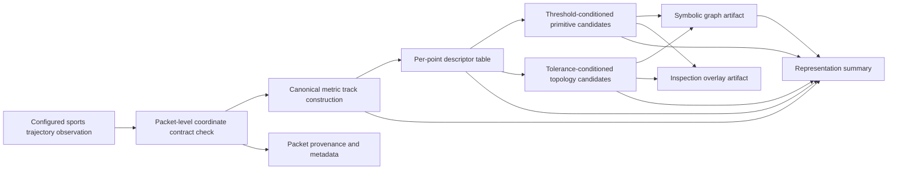

# Figure 1. Deterministic Representation Packet Workflow

**Caption draft:** Configured sports trajectory observations are converted into a deterministic representation packet through packet-level coordinate contract checking, canonical metric track construction, descriptor generation, threshold-conditioned primitive candidate extraction, tolerance-conditioned topology candidate extraction, graph construction, overlay generation, provenance recording, and summary reporting.

**Source basis:** Private packet manifest and provenance summaries.

**Forbidden interpretation:** This workflow does not demonstrate production readiness, external measurement accuracy, universal coordinate-system enforcement, sport-specific semantic interpretation, or robust detection.
