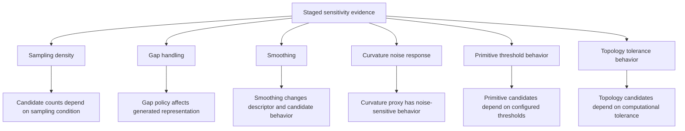

# Figure 3. Staged Sensitivity Evidence Overview

**Caption draft:** Staged sensitivity evidence summarizes how representation outputs respond to sampling density, gap handling, smoothing, curvature noise, primitive thresholds, and topology tolerance. These probes characterize tolerance-conditioned behavior and stability boundaries for the packet rather than providing a unified validation benchmark.

**Source basis:** Public staged sensitivity aggregation in `tables/robustness_summary.csv` and public staged sensitivity summary.

**Forbidden interpretation:** This figure does not show robust validation, ground-truth detection accuracy, external sensor validation, or a unified validation benchmark.
