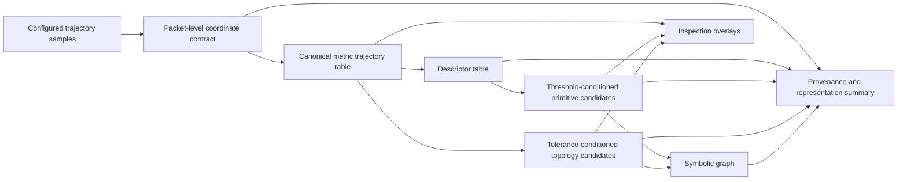
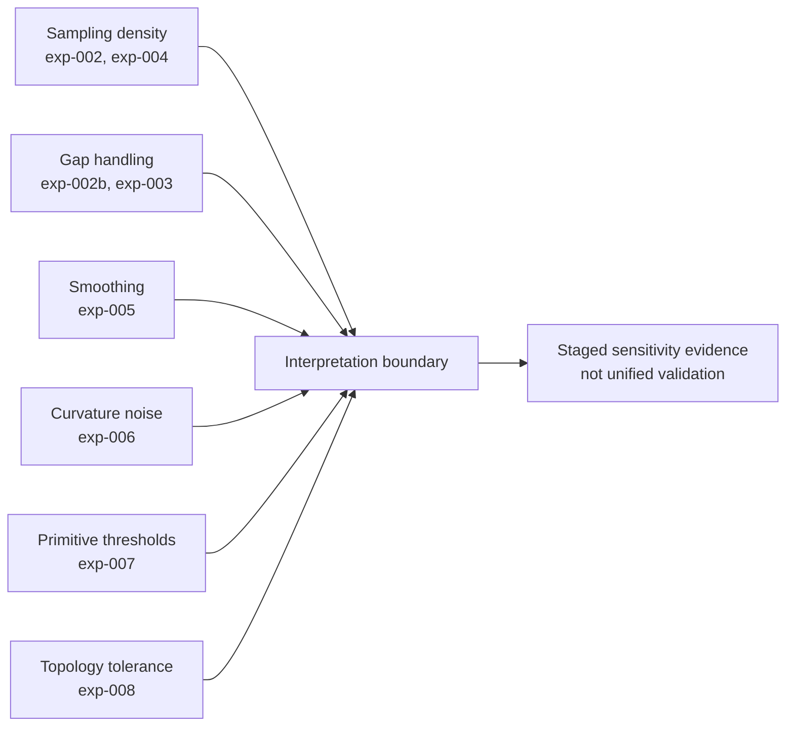

# A Deterministic Spatial Representation Packet for Sports Trajectories Under Explicit Coordinate, Threshold, and Tolerance Assumptions

**Preprint / Technical Report**

**Version**: 1.0.0

**Release date**: 2026-07-13

**Publication status**: Not peer reviewed

**Author information**: Yangchenxi Wu

**Affiliations**: Hungarian University of Sports Science (TF), Budapest, Hungary

**Corresponding author**: Yangchenxi Wu, Hungarian University of Sports Science (TF), Budapest, Hungary. Email: wuyang778@gmail.com.

## Abstract

Sports trajectory analysis often requires geometric and symbolic summaries from finite, noisy observations. This paper demonstrates a deterministic representation pipeline that converts configured sports trajectory samples into an auditable artifact chain under packet-level metric coordinate enforcement and recorded threshold and tolerance assumptions. The generated artifacts include a canonical trajectory table, descriptor table, threshold-conditioned primitive candidates, tolerance-conditioned topology candidates, a symbolic graph, inspection overlays, provenance records, and staged sensitivity summaries.

The contribution is intentionally limited to representation. The study demonstrates artifact generation, traceability, and interpretation boundaries; it does not assess physical reconstruction, sport-specific semantic inference, robust detection, production deployment, calibrated statistical confidence, or external measurement accuracy. Candidate artifacts are treated as deterministic symbolic observations under fixed assumptions, not as externally confirmed movement structures.

Two sports trajectory samples demonstrate the packet. The generated summaries report point counts, descriptor statistics, candidate counts, graph size, coordinate assumptions, score semantics, topology tolerance semantics, and known limitations. The results support a bounded sports-engineering claim: finite sports trajectories can be converted into inspectable deterministic artifacts when coordinate, threshold, tolerance, and sensitivity assumptions are explicitly recorded rather than left implicit in the analysis pipeline.

This technical report documents the representation layer and its interpretation boundaries; application-specific validation is reserved for subsequent studies.

## 1. Introduction

Sports tracking systems, including wearable sensors, GNSS devices, optical systems, and local positioning systems, produce finite spatio-temporal observations that are widely used in sports engineering and performance analysis. Team-sport tracking and GPS or microtechnology systems have been reviewed extensively, and trajectory-analysis surveys describe how spatio-temporal data can be represented, transformed, compared, and mined for downstream analysis (Gudmundsson and Horton, 2016; Cummins et al., 2013; Hu et al., 2023; Sharma et al., 2022).

These observations are useful because they make movement available for computation, but they are conditional rather than assumption-free. Sampling rate, measurement noise, coordinate reference systems, preprocessing choices, and numerical thresholds can affect downstream geometric summaries. In sport tracking, measurement systems are commonly framed through validity and reliability studies rather than treated as direct access to continuous movement (Scott et al., 2016; Varley et al., 2012; Johnston et al., 2014; Akenhead et al., 2014; Pino-Ortega et al., 2022).

This creates a practical gap between sensor-level validity studies and higher-level trajectory analysis. A typical analysis may report distance, speed, stops, turns, or other derived quantities while the coordinate projection, unit convention, threshold definitions, tolerance settings, and source-point traceability behind those quantities remain less visible. A deterministic representation layer cannot remove sensor error or establish movement semantics, but it can make the assumptions behind downstream artifacts explicit.

The present study addresses that intermediate layer by representing metric trajectory observations as a reproducible artifact packet whose coordinate contract, candidate definitions, score semantics, topology tolerance, and provenance are machine-readable and inspectable. This emphasis is consistent with broader work on scientific workflows, provenance, metadata, and transparent reproducible analysis, where outputs are more interpretable when data lineage, processing steps, parameters, and context are recorded (Cuevas-Vicenttin et al., 2013; Leipzig et al., 2020; Meijer et al., 2024).

The practical sports-engineering value is not a new coaching metric or sport-specific detector. It is a representation substrate for reviewing how candidate movement structures were generated: whether trajectory-derived artifacts used declared coordinate assumptions, whether primitive candidates were triggered by recorded thresholds, whether topology candidates were tolerance-conditioned, and whether staged sensitivity evidence exposes limits that should constrain interpretation.

For example, a stop or high-curvature candidate can be difficult to interpret if the coordinate projection, speed threshold, smoothing or preprocessing choice, or source-point mapping is not visible. The same candidate count may support different engineering interpretations depending on whether it was produced from projected metric coordinates, whether thresholds were fixed or tuned, and whether candidate records can be traced back to source observations. The present study does not resolve these interpretation questions by itself; it makes the assumptions needed to ask them explicit.

This paper asks whether sports trajectory observations can be converted into a reproducible and inspectable representation packet under fixed assumptions. Candidate terminology is used throughout: primitive outputs are threshold-conditioned primitive candidates, and topology outputs are tolerance-conditioned topology candidates. A candidate indicates that a deterministic extractor fired under recorded assumptions. It does not indicate physical truth, external correctness, or a ground reference.

Existing staged sensitivity evidence is used to bound interpretation. Prior probes characterize how sampling density, gap handling, smoothing, curvature estimation, primitive thresholds, and topology tolerance affect generated artifacts. These probes support sensitivity and limitation claims, not robust validation or a unified validation benchmark.

The contribution is a conservative representation paper for sports trajectories: a packet-level coordinate contract, threshold-conditioned and tolerance-conditioned candidate semantics, a generated two-sample artifact set, explicit deterministic heuristic score semantics, and staged sensitivity boundaries.

## 2. Methods

### 2.1 Study Design

The pipeline was used as a deterministic artifact generator. Given configured trajectory inputs and fixed parameters, it generated a canonical trajectory table, descriptor table, primitive candidate record, topology candidate record, symbolic graph, inspection overlays, provenance records, and aggregate summaries.

The study design separates artifact generation from claim interpretation. Generated artifacts provide inspectable evidence of pipeline output. Claim boundaries are supplied by packet provenance, limitations, and claim audit documents. This separation is central to the manuscript: candidate outputs are not promoted into physical truth or external correctness claims.

The configured samples were processed in a fixed order. Per-sample summaries were preserved in an aggregate representation summary. Single-file artifacts correspond to the last generated sample, while the aggregate summary preserves the two-sample demonstration. In particular, `outputs/provenance.json` is the projection-and-deduplication provenance for the last generated sample, whereas coordinate contracts and summary records for both samples are preserved in `outputs/representation_summary.json`; packet-level layout details are recorded in `outputs/packet_provenance.json`.

**Figure 1. Deterministic representation packet workflow.**

Caption: Deterministic representation workflow for the proposed representation packet. Configured sports trajectory observations are converted into a canonical metric trajectory table, descriptor table, threshold-conditioned primitive candidates, tolerance-conditioned topology candidates, symbolic graph, inspection overlays, provenance records, and aggregate summaries. Coordinate assumptions are enforced at the packet level before downstream artifacts are generated. This figure demonstrates representation under recorded assumptions; it does not establish production readiness, external accuracy, or universal CRS enforcement.

### 2.2 Samples and Source Metadata

The packet used two configured sports trajectory samples. The first was `skiing_run_01`, labelled as a SkiLoadLab-preprocessed skiing descent. The source table contained 661 rows with elapsed time, WGS84 latitude and longitude, elevation, step-distance, speed, vertical-speed, grade, and upstream-smoothed elevation fields. The descriptor summary recorded a duration of 659.812 s. Source paths and location-derived details are retained in the private packet because they may reveal source-data location and data-layout details.

The second sample was `running_2026-04-09`, labelled as a low-relief park running activity. The source table contained 2770 rows with elapsed time, WGS84 latitude and longitude, elevation, and elevation-policy fields. The descriptor summary recorded a duration of 2767.990 s. Source paths and location-derived details are retained in the private packet for the same reason.

The available packet metadata does not record device model, nominal device sampling frequency, or device-specific measurement accuracy for either sample. Based on raw row counts and elapsed durations, both source files have an observed mean raw interval of approximately 1.0 s, but this derived interval is not treated as a device sampling-rate claim.

The skiing source table included an upstream-smoothed elevation field. This field is treated as source metadata from the SkiLoadLab-preprocessed input, not as a smoothing step applied by the proposed representation packet to projected horizontal coordinates. The proposed representation packet does not apply an additional smoothing policy to projected `x/y` coordinates.

### 2.3 Canonical Track Construction and Coordinate Projection

Each configured sample was required to declare its input coordinate type, source coordinate reference system, projection method, units, axis convention, and metric assumption. Samples lacking this coordinate metadata were rejected by the packet builder. This is packet-level coordinate contract enforcement only; it is not universal CRS enforcement across all software entry points.

Input latitude and longitude observations were projected from WGS84 into a local ENU metric coordinate frame. The first trajectory point defined the local origin. Projected axes were recorded as East, North, and Up in meters. The canonical trajectory table preserved trajectory identity, point order, time, projected coordinates, source identity, and source-point traceability.

Consecutive exact duplicate points were removed during canonical construction using the `consecutive_exact_match` policy. Both raw and post-deduplication point counts were recorded for each sample. The skiing sample was reduced from 661 raw points to 338 post-deduplication points, removing 323 consecutive exact duplicates (48.9% of raw rows). The running sample was reduced from 2770 raw points to 871 post-deduplication points, removing 1899 consecutive exact duplicates (68.6% of raw rows). The packet records this as an observed source-data and preprocessing condition; it does not identify the cause of the duplicate logging behavior.

### 2.4 Per-Point Motion Descriptors

The descriptor layer computed deterministic per-point motion and geometry quantities from the canonical trajectory table. The descriptor table included segment distance, time delta, speed, heading, wrapped turn angle, curvature proxy, local radius, heading variance, tortuosity, and validity flags. The descriptor window size was 5 points.

Descriptors were treated as finite-observation quantities. They were not interpreted as continuous physical measurements. Their interpretation remains dependent on coordinate quality, sampling density, and the documented no-smoothing policy.

### 2.5 Primitive Candidate Extraction and Parameters

Primitive extraction produced threshold-conditioned primitive candidates from descriptor tables. Candidate types included stop, left-turn, right-turn, general turn, high-curvature segment, and direction-reversal candidates.

The packet used a stop speed threshold of 1.5 m/s, stop minimum duration of 2.0 s, turn-angle threshold of 0.5236 rad (pi/6, 30 degrees), curvature threshold of 0.1 rad/m, and reversal-angle threshold of 2.0944 rad (2pi/3, 120 degrees). Overlap candidates used a 5.0 m distance threshold and 10.0 m minimum length. These values are reported as configured parameters, not as optimized or externally supported thresholds.

Each primitive candidate retained source index bounds, parameter snapshots, evidence fields, and a deterministic heuristic score. Packet metadata explicitly states that this score is not a calibrated probability, not artifact-survival evidence, and not comparable statistical confidence across candidate types unless separately supported.

### 2.6 Topology Candidate Extraction

Topology extraction produced tolerance-conditioned topology candidates, including self-intersection, loop, and repeated-path candidates. The topology tolerance was recorded as an observation and computation parameter, not as a physical truth boundary.

Line-segment intersection and predicate decisions are standard computational-geometry operations, and numerical robustness of such predicates is a recognized implementation issue (Bentley and Ottmann, 1979; de Berg et al., 2008; Shewchuk, 1997). These references provide computational-geometry background. The current packet uses deterministic pairwise segment comparison for candidate extraction; it does not claim to implement the Bentley-Ottmann sweep-line algorithm, exact-arithmetic predicates, robust topology recovery, or persistence-tested topology detection.

Packet metadata distinguishes computational numerical tolerance, topology candidate tolerance, and sensor-error tolerance. The configured topology tolerance was `1e-9` in projected coordinate units. It is recorded as a computational predicate tolerance for segment-intersection tests, not as a GNSS or measurement-error tolerance. This study does not estimate sensor-error tolerance.

Topology candidate counts were interpreted as emitted candidate representations. Pairwise segment comparison, endpoint sensitivity, near-collinearity, overlap handling, and dense self-crossing trajectories can produce large candidate sets. Counts should therefore not be read as unique physical crossings.

**Table 2. Provenance, Score, and Tolerance Semantics**

| Metadata item | Packet value or location | Manuscript interpretation | Forbidden interpretation |
| --- | --- | --- | --- |
| Coordinate enforcement scope | `packet_provenance.json`: `coordinate_contract_enforcement = packet_level` | Configured samples in the proposed representation packet must declare coordinate contract metadata before packet build. | Universal repo-wide CRS enforcement. |
| Input coordinate type | Geographic WGS84 latitude/longitude | Inputs were projected before metric descriptors and thresholds were applied. | Raw latitude/longitude can be processed as metric `x/y`. |
| Source CRS | EPSG:4326 | Source coordinate reference system is explicit in packet metadata. | External measurement accuracy assessment. |
| Projection method | `WGS84_latlon_to_local_ENU` | Local metric ENU coordinates were generated for the proposed representation packet artifacts. | Global coordinate correctness or production CRS policy. |
| Axis convention and units | `x=East`, `y=North`, `z=Up`; meters | Distances, speeds, curvature proxies, thresholds, and topology tolerance are interpreted in projected metric units. | Unit-free or CRS-free downstream interpretation. |
| Deduplication policy | `consecutive_exact_match` | Consecutive exact duplicate points were removed before descriptor and candidate generation. | General smoothing, denoising, or resampling policy. |
| Score field | `confidence` field documented as deterministic heuristic score | Scores summarize implementation-defined evidence such as threshold margins and local consistency. | Calibrated probability, perturbation survival, or comparable statistical confidence across candidate types. |
| Topology tolerance | `1e-9` projected coordinate units | Computational predicate tolerance for topology candidate extraction. | GNSS measurement-error tolerance or sensor-error model. |
| Full pipeline parameters | `representation_summary.json.samples[*].pipeline_parameters` | Parameters are recorded per configured sample. | Claim that `provenance.json` alone contains full pipeline provenance. |

### 2.7 Graph, Overlays, and Sensitivity Evidence

The symbolic graph linked source-index boundaries, primitive candidate nodes, topology candidate nodes, and typed graph edges into a deterministic structural representation. The graph demonstrates deterministic construction from candidate artifacts. It does not demonstrate graph persistence, semantic reasoning, or invariant structure under perturbation.

Inspection overlays rendered trajectories and candidate annotations alongside structured artifact data. They support review of generated candidate outputs but do not provide external assessment of candidate correctness.

Existing staged sensitivity probes were used as interpretation context. The probes characterize sensitivity to arc-length resampling, gap handling, smoothing, curvature estimation, primitive thresholds, and topology tolerance. They are heterogeneous staged experiments, not a unified validation benchmark.

## 3. Results

### 3.1 Generated Artifact Chain

The packet generated all required artifact categories: canonical trajectory table, descriptor table, primitive candidate record, topology candidate record, symbolic graph, inspection overlays, coordinate provenance, packet provenance, representation summary, and staged sensitivity summary.

The artifact chain demonstrates deterministic conversion from metric trajectory observations into inspectable representation artifacts under recorded assumptions. Provenance records include packet-level coordinate contract enforcement scope, input coordinate type, source CRS, projection method, origin, units, axis convention, metric assumption, topology tolerance semantics, and heuristic score semantics.

### 3.2 Two-Sample Representation Summary

**Table 1. Two-Sample Representation Summary**

| Sample | Sport label | Duration (s) | Raw points | Post-dedup points | Removed exact duplicates | Mean speed (m/s) | Max speed (m/s) | Mean curvature proxy (rad/m) | Max curvature proxy (rad/m) | Primitive candidates by type | Topology candidates | Graph nodes | Graph edges |
| --- | --- | ---: | ---: | ---: | ---: | ---: | ---: | ---: | ---: | --- | ---: | ---: | ---: |
| `skiing_run_01` | Skiing descent | 659.812 | 661 | 338 | 323 (48.9%) | 6.992 | 25.171 | 0.038 | 0.203 | high-curvature 7; left-turn 11; right-turn 15; stop 1; turn 37 | 0 | 207 | 347 |
| `running_2026-04-09` | Running activity | 2767.990 | 2770 | 871 | 1899 (68.6%) | 1.967 | 17.386 | 0.473 | 3.112 | direction-reversal 151; high-curvature 131; left-turn 42; right-turn 44; stop 95; turn 90 | 4372 | 5695 | 15543 |

Caption: Sample-level representation counts and descriptor summaries for the two configured sports trajectories. Counts demonstrate artifact generation on two samples; they do not demonstrate generalization, candidate correctness, unique physical crossings, or external measurement accuracy.

For the skiing sample, the representation summary recorded 661 raw points and 338 points after deduplication. The generated artifacts contained 71 primitive candidates, 0 topology candidates, 207 graph nodes, and 347 graph edges. Primitive candidates comprised 7 high-curvature segments, 11 left-turn candidates, 15 right-turn candidates, 1 stop candidate, and 37 turn candidates. The descriptor summary reported mean speed 6.992 m/s, maximum speed 25.171 m/s, mean curvature proxy 0.038 rad/m, and maximum curvature proxy 0.203 rad/m.

For the running sample, the representation summary recorded 2770 raw points and 871 points after deduplication. The generated artifacts contained 553 primitive candidates, 4372 topology candidates, 5695 graph nodes, and 15543 graph edges. Primitive candidates comprised 151 direction-reversal candidates, 131 high-curvature segments, 42 left-turn candidates, 44 right-turn candidates, 95 stop candidates, and 90 turn candidates. The descriptor summary reported mean speed 1.967 m/s, maximum speed 17.386 m/s, mean curvature proxy 0.473 rad/m, and maximum curvature proxy 3.112 rad/m.

These counts demonstrate deterministic artifact generation on two sports trajectory samples. The high consecutive-exact-duplicate removal rates are important interpretation context: descriptor, primitive, topology, graph, and overlay artifacts are generated from the post-deduplication canonical tracks, while raw and post-deduplication counts remain part of the provenance. The packet records the duplicate-removal outcome but does not contain source-system metadata sufficient to determine the cause of repeated identical rows. The counts do not demonstrate generalization across sports, correctness of candidate annotations, unique physical crossings, or externally measured accuracy.

**Figure 2. Representative inspection overlay.**

**Restricted asset note**: The representative overlay image is generated in the private packet but is not included in this public-safe repository because it can reveal trajectory geometry and location-derived information.

Caption: Representative inspection overlay with generated candidate annotations and linked structured artifact data. The overlay supports inspection of deterministic candidate outputs and their source-index traceability. Candidate annotations are not true movement structures, ground-reference labels, robust detections, or externally confirmed sport semantics.

### 3.3 Topology Candidate Count Interpretation

The running sample produced 2186 `self_intersection_candidate` records and 2186 `loop_candidate` records, for 4372 total topology candidates. This count reflects emitted candidate representations from pairwise segment comparisons on a dense, self-crossing trajectory under the configured `1e-9` computational predicate tolerance. It should not be interpreted as 4372 unique physical crossings.

The paired count also reflects representation rules: one geometric relationship can emit more than one candidate type when both self-intersection and loop criteria are represented. The result supports the manuscript's tolerance-conditioned topology limitation rather than a claim about real-world trajectory complexity.

### 3.4 Sensitivity Boundaries

The staged sensitivity summary indicates that resampling and gap handling can change candidate counts, smoothing can change structural descriptors, coordinate noise can affect curvature, primitive candidates are threshold-sensitive, and topology candidates are tolerance-conditioned.

**Figure 3. Staged sensitivity evidence overview.**

Caption: Staged sensitivity axes used to bound interpretation of the representation packet. Existing probes characterize sampling density, gap handling, smoothing, curvature estimation, primitive threshold sensitivity, and topology tolerance behavior. This is not a unified validation benchmark, robust validation, or proof of correct candidate detection.

This evidence is boundary evidence. It identifies where generated artifacts persist, shift, appear, or disappear under controlled changes. It does not establish robust detection or a unified stability metric.

## 4. Discussion

The results support the manuscript's central representation claim. Under packet-level metric coordinate enforcement and fixed parameters, sports trajectory observations were converted into a deterministic chain of inspectable artifacts. The generated packet records both the artifacts and the assumptions needed to interpret them.

The main methodological value is not candidate detection accuracy, but traceable representation. Candidate outputs are tied to source index ranges, parameters, evidence fields, score semantics, and provenance records. This makes the artifact chain auditable without implying physical reconstruction or sport-specific semantic truth.

For sports engineering, this is useful because many trajectory-derived conclusions depend on assumptions that may otherwise remain implicit. A practical case is an analyst receiving a GNSS-derived track and wanting to inspect whether a reported stop or high-curvature candidate was generated from projected metric coordinates, which threshold produced it, whether smoothing or deduplication occurred, and which source observations support the candidate. The packet makes those questions inspectable before any downstream sport-specific interpretation is attempted.

The staged sensitivity evidence also gives the packet a practical role. It shows that candidate counts and descriptor values can change under sampling, gap handling, smoothing, coordinate-noise, threshold, and topology-tolerance changes. This does not provide robust validation, but it does warn against treating threshold-derived candidate counts as assumption-free measurements. For sports engineering workflows, the implication is that candidate summaries should be interpreted with their coordinate, sampling, threshold, and tolerance conditions attached.

The running sample illustrates a key interpretation risk. Its large topology candidate count reflects tolerance-conditioned pairwise geometry, dense repeated trajectory structure, and candidate representation rules. It should not be interpreted as a count of unique crossings or as a direct measure of real trajectory complexity.

The packet deliberately stops before sport-specific semantics. A geometric stop candidate is not a confirmed tactical stop, a turn candidate is not a sport-defined maneuver, and a topology candidate is not an externally confirmed movement structure. The present study treats these as auditable intermediate representations, not as completed sport-performance interpretations.

In a practical workflow, the packet could sit between raw trajectory cleaning and downstream domain-specific interpretation. Analysts could first inspect whether candidate artifacts were generated under declared coordinate, threshold, tolerance, and score assumptions, and only then decide whether a subset of candidates should be carried into a separate private analysis. In this sense, the packet is not the final analysis layer; it is an assumption-explicit representation layer that can make later analysis more inspectable.

The packet also clarifies what remains outside the present study. Universal CRS enforcement, canonical resampling, perturbation-based confidence, topology persistence metrics, external accuracy assessment, and production deployment remain unsupported by the present manuscript.

The present study should therefore be read as an assumption-explicit representation contribution. It demonstrates that configured sports trajectory samples can be converted into inspectable deterministic artifacts with recorded coordinate, threshold, tolerance, score, and sensitivity assumptions. It does not validate movement structures, provide sport-specific interpretation, or establish production deployment readiness.

## 5. Limitations and Future Work

Coordinate contract enforcement is packet-level only. The proposed representation packet rejects configured samples that lack explicit coordinate metadata and records the metric projection assumptions used for the demonstrated samples. This does not establish universal CRS enforcement across every software entry point. Direct use of lower-level descriptor, primitive, topology, or overlay functions outside the packet builder is not covered by this packet-level enforcement claim.

Resampling remains experimental and is not a canonical preprocessing policy. Existing staged evidence characterizes sensitivity to sample spacing and gap handling, but it does not define a production resampling step.

Confidence values are deterministic heuristic scores. They summarize implementation-defined evidence such as threshold margin and local consistency. They are not calibrated probabilities, perturbation survival rates, or comparable statistical quantities across candidate types.

Topology candidates are tolerance-conditioned. Endpoint-sensitive, overlap-sensitive, and near-threshold structures can appear, disappear, or shift under coordinate perturbation or tolerance changes. The current computational predicate tolerance is not a sensor-error tolerance. The computational-geometry references used in the Methods section provide background; the current implementation does not claim exact arithmetic, a sweep-line intersection algorithm, or a robust geometry kernel.

The study does not include a unified validation benchmark. Individual staged probes support sensitivity discussion, but they do not provide artifact-level survival rates, cross-experiment matching rules, or graph persistence metrics.

The study does not bridge geometric candidates to sport-specific constructs. The primitive vocabulary is intentionally geometric and sport-agnostic. It does not identify sport-defined maneuvers, technical phases, performance outcomes, injury-risk markers, or coaching categories.

The study is demonstrated on two sports trajectory samples. It does not test multiple athletes within a sport, repeated sessions for the same athlete, device-to-device agreement, or generalization across recording conditions. Device model, nominal sampling frequency, duplicate-row cause, and sensor-specific accuracy metadata were not available in the packet metadata.

The study also does not include external assessment of candidate correctness. External assessment is outside the Methods and Results claims in the present study.

## 6. Conclusion

This paper demonstrates a conservative deterministic representation packet for sports trajectories. Under packet-level metric coordinate enforcement and recorded threshold, tolerance, and score assumptions, the pipeline generates auditable artifacts and exposes the limits needed to interpret them.

The defensible claim is representation, not validation. Finite sports trajectories can be converted into inspectable deterministic artifacts when candidate semantics, coordinate assumptions, tolerance semantics, heuristic scores, and staged sensitivity boundaries remain explicit.

## Data and Code Availability

The public-safe companion repository for this technical report is `https://github.com/YangchenxiWu/paper-a-sports-trajectory-representation`. The release branch is `codex/representation-packet-technical-report-v1.0.0`, and the exact release tag is `representation-packet-technical-report-v1.0.0`. The reserved Zenodo version DOI is `https://doi.org/10.5281/zenodo.21340626`; the unchanged Zenodo concept DOI for all versions is `https://doi.org/10.5281/zenodo.21192883`. The historical public version DOI `https://doi.org/10.5281/zenodo.21193034` remains unchanged.

The public repository contains the technical-report manuscript, release metadata, claim-boundary documents, public-safe figure and table views, and staged sensitivity summaries. It does not include raw trajectories, canonical tracks, descriptor tables, primitive/topology/graph artifacts, overlay HTML/PNG files, projection origins, source-data paths, or private implementation materials. Those materials remain private because they may reveal trajectory geometry, source-data layout, or location-derived information. See `DATA_ACCESS.md`.

## Acknowledgements

Not applicable.

## Statements and Declarations

### Ethical considerations

The trajectory samples used in this manuscript were self-recorded by the author. No external human participants, animal subjects, or clinical intervention were involved. The public companion repository does not release raw trajectories, location-resolving trajectory artifacts, participant images, videos, or identifiable personal information.

### Consent to participate

Not applicable. The trajectory samples were self-recorded by the author and no external participants were recruited.

### Consent for publication

Not applicable. No identifiable participant images, videos, raw trajectories, or location-resolving trajectory artifacts are published.

### Declaration of conflicting interest

The author declared no potential conflicts of interest with respect to the research, authorship, or publication of this technical report.

### Funding

The author received no financial support for the research, authorship, or publication of this technical report.

## References

Akenhead, R., French, D., Thompson, K. G., & Hayes, P. R. (2014). The acceleration dependent validity and reliability of 10 Hz GPS. *Journal of Science and Medicine in Sport, 17*(5), 562-566. https://doi.org/10.1016/j.jsams.2013.08.005

Bentley, J. L., & Ottmann, T. A. (1979). Algorithms for reporting and counting geometric intersections. *IEEE Transactions on Computers, C-28*(9), 643-647.

Cuevas-Vicenttin, V., Dey, S., Kohler, S., Riddle, S., & Ludascher, B. (2013). *Scientific Workflows and Provenance: Introduction and Research Opportunities*. arXiv:1311.4610. https://arxiv.org/abs/1311.4610

Cummins, C., Orr, R., O'Connor, H., & West, C. (2013). Global Positioning Systems (GPS) and microtechnology sensors in team sports: A systematic review. *Sports Medicine, 43*(10), 1025-1042. https://doi.org/10.1007/s40279-013-0069-2

de Berg, M., Cheong, O., van Kreveld, M., & Overmars, M. (2008). *Computational Geometry: Algorithms and Applications* (3rd ed.). Springer.

Gudmundsson, J., & Horton, M. (2016). *Spatio-Temporal Analysis of Team Sports: A Survey*. arXiv:1602.06994. https://arxiv.org/abs/1602.06994

Hu, D., Chen, L., Fang, H., Fang, Z., Li, T., & Gao, Y. (2023). *Spatio-Temporal Trajectory Similarity Measures: A Comprehensive Survey and Quantitative Study*. arXiv:2303.05012. https://arxiv.org/abs/2303.05012

Johnston, R. J., Watsford, M. L., Kelly, S. J., Pine, M. J., & Spurrs, R. W. (2014). Validity and interunit reliability of 10 Hz and 15 Hz GPS units for assessing athlete movement demands. *Journal of Strength and Conditioning Research, 28*(6), 1649-1655. https://doi.org/10.1519/JSC.0000000000000323

Leipzig, J., Nust, D., Hoyt, C. T., Soiland-Reyes, S., Ram, K., & Greenberg, J. (2020). *The role of metadata in reproducible computational research*. arXiv:2006.08589. https://arxiv.org/abs/2006.08589

Meijer, P., Howard, N., Liang, J., Kelsey, A., Subramanian, S., Johnson, E., et al. (2024). *Provide Proactive Reproducible Analysis Transparency with Every Publication*. arXiv:2408.09103. https://arxiv.org/abs/2408.09103

Pino-Ortega, J., Oliva-Lozano, J. M., Gantois, P., Nakamura, F. Y., & Rico-Gonzalez, M. (2022). Comparison of the validity and reliability of local positioning systems against other tracking technologies in team sport: A systematic review. *Proceedings of the Institution of Mechanical Engineers, Part P: Journal of Sports Engineering and Technology, 236*(2), 73-82. https://doi.org/10.1177/1754337120988236

Scott, M. T. U., Scott, T. J., & Kelly, V. G. (2016). The validity and reliability of global positioning systems in team sport. *Journal of Strength and Conditioning Research, 30*(5), 1470-1490. https://doi.org/10.1519/JSC.0000000000001221

Sharma, A., Jiang, Z., & Shekhar, S. (2022). *Spatiotemporal Data Mining: A Survey*. arXiv:2206.12753. https://arxiv.org/abs/2206.12753

Shewchuk, J. R. (1997). Adaptive precision floating-point arithmetic and fast robust geometric predicates. *Discrete & Computational Geometry, 18*, 305-363. https://doi.org/10.1007/PL00009321

Varley, M. C., Fairweather, I. H., & Aughey, R. J. (2012). Validity and reliability of GPS for measuring instantaneous velocity during acceleration, deceleration, and constant motion. *Journal of Sports Sciences, 30*(2), 121-127. https://doi.org/10.1080/02640414.2011.627941
